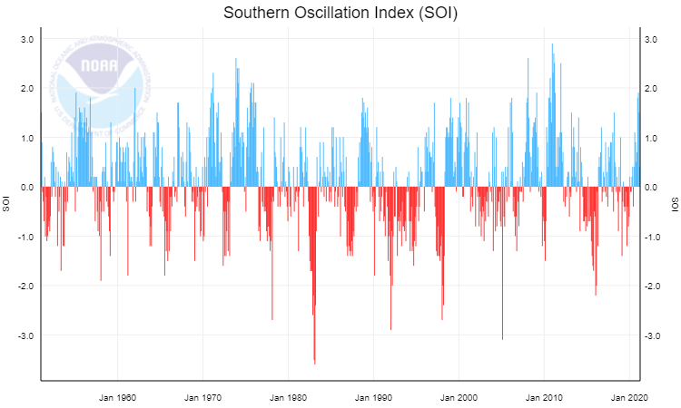

# Time series analysis of SOI

The Southern Oscillation Index \(SOI\) is a standardized index based on the observed sea level pressure differences between Tahiti and Darwin, Australia. The SOI is one measure of the large-scale fluctuations in air pressure occurring between the western and eastern tropical Pacific \(i.e., the state of the Southern Oscillation\) during El Niño and La Niña episodes.  Complete info at NOAA [Climate Monitoring](https://www.ncdc.noaa.gov/teleconnections/enso/indicators/soi/) 

### Objective

Use the dataset provided to create a time series analysis of SOI using same basic criteria\(formulas, data\) as the official.

### Requirements

* Official dataset and formulas
* Any programming library\(statsmodels, pycaret, FB Prophet etc\)
* Any data visualization library or software\(Tableau, Power BI etc\)

### Material

Dataset [CSV](https://www.ncdc.noaa.gov/teleconnections/enso/indicators/soi/data.csv) \| [JSON](https://www.ncdc.noaa.gov/teleconnections/enso/indicators/soi/data.json) \| [XML](https://www.ncdc.noaa.gov/teleconnections/enso/indicators/soi/data.xml)

